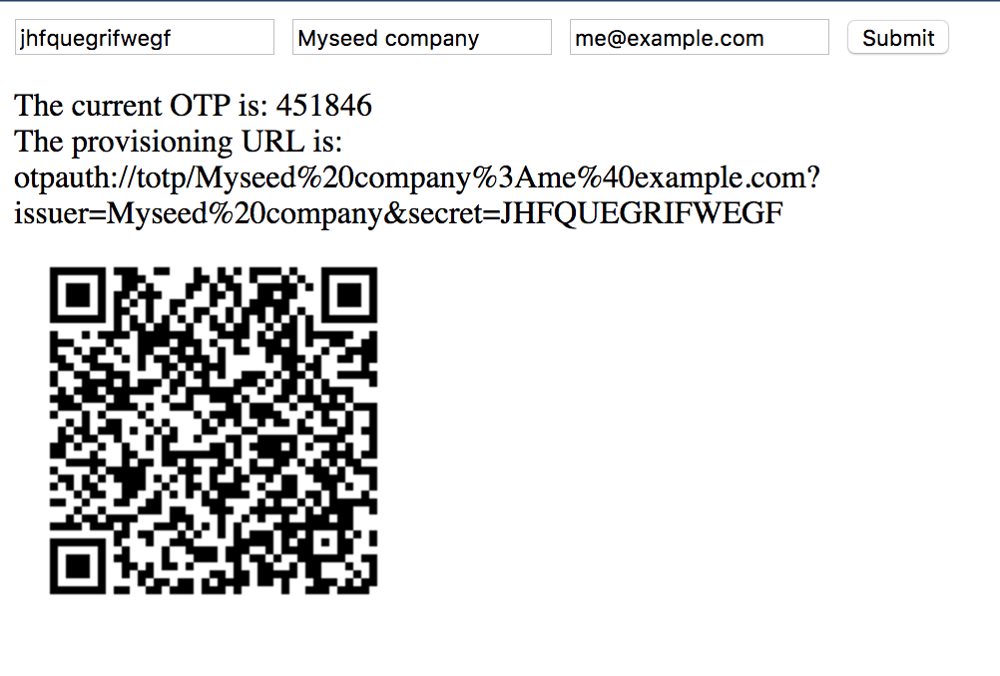

# Google Authenticator QR code generator



## Purpose 

Use this docker image to clone your Google Authenticator accounts from Android device. To access active accounts on 
you device you have to be on rooted phone. To list all your accounts in Authenticator app use the command below: 

```shell 
$ adb shell
device:/ $ su
device:/ # cd /data/data/com.google.android.apps.authenticator2/databases
device:/data/data/com.google.android.apps.authenticator2/databases # sqlite3 ./databases                                                                      
SQLite version 3.9.2 2015-11-02 18:31:45
Enter ".help" for usage hints.
sqlite> select * from accounts ;
1|Example Company:test@example.com|QUU6EA2GHORGMD22SN2YKU6VKISCKYAG|0|0|0|Example Company|Example Company:test@example.com
sqlite> 
```

So the seed code for Example Company account for TOTP code generation is QUU6EA2GHORGMD22SN2YKU6VKISCKYAG in example above. 
Other values are not important and are used as descriptions for you to distinguish the account.

You can also use this container to generate codes online, if you know the seed code so you dont need to actually install the
Authenticator app. 

## Running the container

To build the container use this command (docker has to be installed):

```shell
docker build -f "Dockerfile" -t "totp:latest" "./"
```

To run container use this command: 

```shell
docker run --name totp -p 80:80 totp:latest
```

Access the UI on http://localhost/ using browser. 


